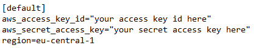

# CarCare Companion

A modern and responsive online car diary built with ASP.NET Core Web API and ReactJS and Amazon S3 Cloud Object Storage. Effortlessly add and manage your vehicles, trips, tax details, and service records. 

## Description
CarCare Companion isn't just a tool, it's your all-in-one personal vehicle management assistant. Keep a meticulous record of every vehicle, every journey, and every maintenance activity. With a friendly reminder system, stay ahead of critical dates, ensuring your vehicle stays in tip-top condition!

## Features 
- Vehicle Management: Seamlessly add, update, or remove vehicles from your personal fleet.
- Trip Logs: Maintain an organized record of all your trips with date, distance, used fuel and fuel cost.
- Tax and Service Records: Track tax payments, service histories, and other essential records for every vehicle.
- Reminders: Automated email reminders for upcoming tax renewal.
- User-Friendly Dashboard: An intuitive and sleek dashboard to oversee all your records at a glance.
  
## Technologies used
- Backend: ASP.NET Core Web API
- Database : MS SQL Server
- Frontend: ReactJS
- Email Service: Gmail SMTP server
- Cloud Storage : Amazon S3
- Scheduler : Quartz.NET

## Database diagram
  
## Getting Started

### Prerequisites
- .NET 6.0
- Node.js (v16.17.0. or higher)
- Microsoft SQL Server (v16.0.1000 or higher)

### Installation
1. Clone the repository:
[https://github.com/Pisarevv/FurnitureStore.git](https://github.com/Pisarevv/CarCare-Companion.git)

2. Navigate to the client project directory

3. Install the dependencies for the client
- npm init 

4. Create a "credentials" file containing your Amazon S3 profile.  
##### Option 1 
- Create an "credentails" file in the directory - "C:\Users\CurrentUser\.aws".
The file looks the following way: 
  
For more information - https://docs.aws.amazon.com/cli/latest/userguide/cli-configure-files.html  

##### Option 2 
- Using the Visual Studio AWS Toolkit.  
Follow the steps shown in the article - https://docs.aws.amazon.com/toolkit-for-visual-studio/latest/user-guide/keys-profiles-credentials.html

5. Configurate the JWT token, Connection string and MailSettings.
Example of how the configuration should look:  
  

6. Configure the CORS policy to accept request from the frontend application based on the localhost port that is running.

### Running the Application

1. Start the backend server:
- Open it with Visual Studio and open the application.
- Update the database with the Package Manager Console - Open the Packet Manager Console and type "Update database" command.
- Start the application

2. Start the client server:
- Open Visual Studio Code terminal and type "npm run dev"

The application should open host its self on `http://localhost:5173/`.

## Usage

1. Browse the home page.
2. Create an account or log in to be able to add vehicles, trips, tax or service records.
   The server is initialized with one adminstrator account: 
   admin@carcare.com : admin123
3. Add a vehicle to begin your journey. You can later viwe its details and edit or delete it.
4. Add, edit or remove trip, tax or service records.
5. Using the administrator account you can edit the carousel ads and add or remove other users as admins.

## License

This project is licensed under the GNU General Public License. See the [LICENSE.md](./LICENSE.md) file for details.

## Acknowledgments
Special thanks to the creators and communities of our utilized technologies:  
- [ASP.NET Core Web API](https://learn.microsoft.com/en-us/aspnet/core/?view=aspnetcore-6.0)
- [MS SQL Server](https://www.microsoft.com/en-us/sql-server)
- [Serilog](https://serilog.net/)
- [React](https://reactjs.org/) and [Vite](https://vitejs.dev/) for the project setup.
- [ASP.NET Core Template by Nikolay Kostov, Vladislav Karamfilov and Stoyan Shopov](https://github.com/NikolayIT/ASP.NET-Core-Template)
- [React router](https://reactrouter.com/en/main)
- [React-loader-spinner](https://mhnpd.github.io/react-loader-spinner/)
- [React-notifications-component](https://github.com/teodosii/react-notifications-component)
- [Axios](https://axios-http.com/)
- [DayJS](https://github.com/iamkun/dayjs)
- [Quartz.NET](https://www.quartz-scheduler.net/)

